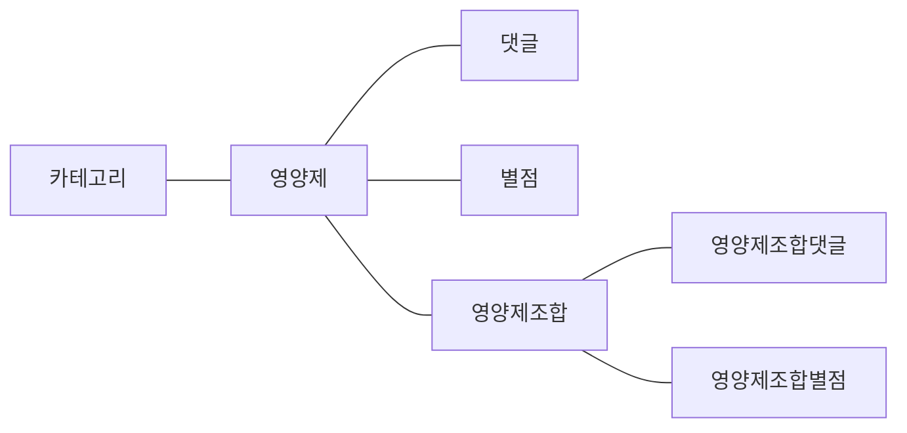

# Nutrient (영양분)
> "영양제를 분석하다"의 줄임말로 영양제를 조합별로 추천해주는 프로젝트.

## 목표

1. Spring, JPA 환경에서 OOP, 도메인 모델 패턴, 클린 코드에 대해 학습한 내용을 적용해 보는 경험
2. JUnit5, Mockito를 활용한 단위 테스트 작성 방법 학습

## 기술 스택

## 도메인 모델

```mermaid
flowchart LR    
    카테고리 --- 영양제
    영양제 --- 댓글
    영양제 --- 별점
    
    영양제 --- 영양제조합
    영양제조합 --- 영양제조합댓글
    영양제조합 --- 영양제조합별점
```
